```mermaid
flowchart TD
    subgraph Triggers["Pull request triggers"]
        PR["opened / synchronize / reopened / ready_for_review"]
    end

    subgraph Changes["compute-changes"]
        Files["changed files"]
        Affected["affected crates + reverse deps"]
        ClippyBins["clippy binpack\nplan-clippy-batches.sh"]
        TestBins["crate-test binpack\nplan-test-batches.sh"]
        Backend["backend_changed?"]
        BackendRecipe["backend_recipe_changed?"]
        InferenceArtifact["inference_artifact_required?"]
        WindowsCPU["windows_cpu_build_required?"]
        WindowsGPU["windows_gpu_build_required?"]
        SDK["sdk_smoke_required?"]
        Website["website_changed?"]
        WebsiteDocs["website_docs_changed?"]
        CLIDocs["cli_surface_changed?"]
        Docs["docs_only?"]
    end

    PR --> Files --> Affected
    Affected --> ClippyBins
    Affected --> TestBins
    Files --> Backend
    Files --> BackendRecipe
    Files --> WindowsCPU
    Files --> WindowsGPU
    BackendRecipe --> Backend
    BackendRecipe --> WindowsCPU
    BackendRecipe --> WindowsGPU
    Affected --> InferenceArtifact
    Backend --> InferenceArtifact
    SDK --> InferenceArtifact
    Affected --> SDK
    Files --> Website
    Files --> WebsiteDocs
    Files --> CLIDocs
    Files --> Docs

    subgraph Quality["pr_quality.yml · PR Quality Checks"]
        direction TB
        Fmt["rust-fmt"]
        Clippy["rust-clippy matrix\nweighted affected-crate bins"]
        UIQ["ui-quality\nReact console"]
        CLIDocsSync["cli-docs-sync\nCLI surface requires public docs"]
        QSummary["summary"]
        Fmt --> QSummary
        Clippy --> QSummary
        UIQ --> QSummary
        CLIDocsSync --> QSummary
    end

    subgraph WebsitePR["pr_website.yml · PR Website Checks"]
        direction TB
        WebsiteBuild["website-build\nEleventy/Tailwind/Pagefind"]
        WebsiteSummary["summary"]
        WebsiteBuild --> WebsiteSummary
    end

    ClippyBins --> Clippy
    Affected --> Fmt
    Files --> UIQ
    Website --> WebsiteBuild
    WebsiteDocs --> CLIDocsSync
    CLIDocs --> CLIDocsSync

subgraph PRCI["pr_builds.yml · PR Builds"]
        direction TB
        subgraph Producers["top-level target jobs"]
            LinuxCPU["linux_cpu_artifact\ndebug mesh-llm · CLI smoke\n→ ci-linux-inference-binaries"]
            RustCrateTests["rust_crate_tests matrix\nmetadata-derived crate suites"]
            LinuxTests["linux_test_groups matrix\nprotocol · Skippy smoke"]
            LinuxTargets["linux_targets matrix\nCUDA / ROCm / Vulkan rows build when backend_changed"]
            WindowsTargets["windows_targets matrix\nCPU / CUDA / ROCm / Vulkan\nfull builds only for Windows inputs"]
            MacCPU["macos_cpu_artifact\nmacOS Metal build · CLI smoke\n→ ci-macos-inference-binaries"]
            MacTests["macos_unit_tests"]
            MacTargets["macos_targets matrix\nCUDA / ROCm / Vulkan explicit skips"]
        end

        subgraph Smokes["artifact-consuming smokes"]
            Restore["restore-smoke-inputs action\ndownload artifact · stage binary · restore model"]
            Inference["smoke.yml\nLinux inference + OpenAI + split serving"]
            Scripted["scripted-binary-smoke.yml\ntwo-node client/serving"]
            SDKSmoke["sdk-smoke.yml\nnative · Kotlin · Swift"]
        end
    end

    Docs -. "true: gate heavy jobs" .-> PRCI
    InferenceArtifact --> LinuxCPU
    Affected --> LinuxTests
    TestBins --> RustCrateTests
    InferenceArtifact --> MacCPU
    Affected --> MacTests
    Backend --> LinuxTargets
    WindowsCPU --> WindowsTargets
    WindowsGPU --> WindowsTargets
    Backend --> MacTargets
    LinuxCPU -- "artifact: ci-linux-inference-binaries" --> Restore
    MacCPU -- "artifact: ci-macos-inference-binaries" --> Restore
    Restore --> Inference
    Restore --> Scripted
    Restore --> SDKSmoke
    SDK --> SDKSmoke

    subgraph Cleanup["pr_cleanup.yml · PR Cache Cleanup"]
        Closed["pull_request_target closed"]
        PlanCaches["plan cache shards for\nrefs/pull/<PR>/merge"]
        DeleteCaches["matrix delete cache shards\nrepo-var workers · serial per worker"]
        DeleteArtifacts["delete artifacts from\nmatched PR workflow runs"]
        CleanupSummary["cleanup summary"]
        Closed --> PlanCaches --> DeleteCaches
        Closed --> DeleteArtifacts
        DeleteCaches --> CleanupSummary
        DeleteArtifacts --> CleanupSummary
    end

    subgraph MainRelease["non-PR workflows"]
        MainCI["ci.yml\npush main / dispatch"]
        WebsiteDeploy["website-pages.yml\nActions Pages deploy\nPublic Website environment"]
        DockerValidate["docker.yml\nmanual client Dockerfile validation"]
        Release["release.yml\nrelease artifacts + packaging dispatch"]
        FlyConsole["fly-deploy-console.yml\nmanual Fly console deploy"]
    end

    style Quality fill:#1a3a5c,stroke:#4a90d9,color:#e8f4fd
    style WebsitePR fill:#1f355c,stroke:#8ab4f8,color:#e8f4fd
    style PRCI fill:#1a3d2e,stroke:#2ecc71,color:#eaffef
    style Producers fill:#1a3d2e,stroke:#2ecc71,color:#eaffef
    style Smokes fill:#17324d,stroke:#4a90d9,color:#e8f4fd
    style Cleanup fill:#3d2b00,stroke:#f39c12,color:#fff8e1
    style MainRelease fill:#2a2a2a,stroke:#888,color:#ddd
```

## Current PR Builds contract

- `pr_quality.yml` is named **PR Quality Checks** and owns the earliest Rust,
  React console, and CLI-documentation feedback: formatting, React console UI
  quality when relevant, the CLI-docs sync guard when Rust CLI definitions
  change, and deterministic clippy bins from
  `scripts/plan-clippy-batches.sh`. Its summary job writes a Markdown table to
  `$GITHUB_STEP_SUMMARY` instead of printing a terminal-only table.
- `pr_website.yml` is named **PR Website Checks** and owns the public website PR
  canary. It uses `.github/actions/compute-changes` and runs
  `website-build` only when `website_changed` is true, or when manually
  dispatched, so public website validation is separate from Rust/React-console
  quality checks while still using the central routing signals.
- `ui_changed` and `website_changed` intentionally describe different products:
  `ui_changed` is only the embedded React console under `crates/mesh-llm-ui/**`,
  while `website_changed` is only the public Eleventy/Tailwind/Pagefind website
  and its passthrough inputs. Website changes do not trigger React console UI
  quality or UI artifact rebuilds.
- CLI surface changes in `crates/mesh-llm-cli/src/{parser,models,runtime,benchmark}.rs`
  set `cli_surface_changed`. When that flag is true, `cli-docs-sync` requires a
  public website docs/example update under `website/src/docs/pages/` or
  `website/src/_includes/`, with `website/src/docs/pages/CLI.md` as the primary
  command reference.
- `pr_builds.yml` is named **PR Builds** and owns PR target jobs plus integration
  and smoke validation. Linux and macOS CPU artifact jobs upload the binaries
  that downstream smoke jobs consume before long validation groups finish.
  Every affected Rust workspace crate is assigned to a generated
  `rust_crate_tests` matrix and runs its complete `cargo test -p <crate>` suite;
  protocol compatibility and Skippy smoke remain separate integration rows.
  Linux/macOS backend matrices remain separate from the CPU artifact producers.
- Pull requests test affected crates plus their reverse dependents. Main pushes
  and manual dispatches assign every Cargo workspace member to the matrix, so a
  targeted-routing mistake cannot permanently hide a crate suite.
- `rust_changed` is not an artifact-build signal. Rust tooling changes such as
  `tools/xtask/**` still run PR Quality formatting/clippy, but PR Builds only
  builds `mesh-llm` artifacts when `inference_artifact_required` is true: a
  runtime-facing crate, SDK smoke input, React console UI artifact input,
  backend/native input, all-rust fail-open/escalation, or manual dispatch.
- `Justfile` is routed by changed hunks, not by path alone. Website/dev recipe
  edits stay light, while native build, ABI, release, bundle, and package
  recipe edits set `backend_recipe_changed`, which feeds backend artifacts and
  Windows CPU/GPU build eligibility.
- Workflow/orchestration-only PR edits validate the PR routing graph without
  becoming Rust crate changes. They must not fan out into Linux/macOS artifact
  producers, native backend, Windows GPU, benchmark, or SDK-smoke lanes unless a
  changed file also affects Rust crates, React console UI assets, public website
  inputs, SDK inputs, or backend products. Backend lanes are reserved for files
  that can affect native ABI/backend products, such as `third_party/llama.cpp/**`,
  `crates/skippy-ffi/**`, backend build scripts, backend-relevant Justfile
  hunks, and `.github/cache-version.txt`.
- Windows target jobs use compute-changes' `windows_cpu_build_required` and
  `windows_gpu_build_required` outputs for full platform builds. The CPU row can
  still run lightweight Windows cargo checks for broad Rust changes, but
  CUDA/ROCm/Vulkan rows stay skipped unless Windows GPU inputs changed,
  backend-relevant Justfile hunks changed, or the workflow is manually
  dispatched.
- `pr_cleanup.yml` deletes PR merge-ref caches and artifacts from positively
  matched PR workflow runs when a pull request closes. Cache cleanup first plans
  deterministic shards, then fans deletion out across
  `vars.PR_CACHE_CLEANUP_WORKERS` workers (default `5`) while keeping each worker
  serial and rate-limited; a final summary aggregates cache shard results plus
  artifact cleanup. Cleanup-only workflow edits do not fan out into
  Rust/build/smoke jobs.
- Docker image validation and publishing are intentionally not part of pull
  request CI. `docker.yml` is a manual, non-publishing client Dockerfile
  validation workflow. `release.yml` owns release archives and dispatches the
  completed full release to `Mesh-LLM/mesh-agent-images`, which is the sole
  GHCR publisher.
- `fly-deploy-console.yml` is a manual (`workflow_dispatch`) deploy of the
  `mesh-llm-console` Fly app. It builds the image on Fly's remote builders from
  `fly/Dockerfile` and authenticates with the app-scoped `FLY_API_TOKEN` repo
  secret. It carries no pull request trigger and does not run release or smoke
  jobs.

## Prebuilt runner image contract

Linux CI environments are maintained in
[`Mesh-LLM/mesh-llm-runner-images`](https://github.com/Mesh-LLM/mesh-llm-runner-images)
and published at `ghcr.io/mesh-llm/mesh-llm-cuda-runner`. Every image is built
from the same core toolchain and selects an execution environment independently
from its backend SDK:

- `public-<backend>-*` runs as a job-level `container:` on an Ubuntu GitHub-hosted
  or legacy container-capable self-hosted runner.
- `self-hosted-<backend>-*` adds the Actions runner and is used directly as an
  ARC pod image. Jobs targeting an ARC scale-set label must not wrap that pod in
  a second job container.
- CPU, Vulkan, CUDA 12, and CUDA 13 publish AMD64 and ARM64 manifest children.
  ROCm 7.0 and 7.2 are AMD64-only until an ARM64 ROCm lane is supported and
  verified by MeshLLM.

The compatibility `public-*` manifest selects CPU on both architectures. The
compatibility `self-hosted-*` manifest preserves the deployed K3s topology by
selecting CUDA 12 on AMD64 and CPU on ARM64. New consumers should use an
explicit backend image instead of relying on those aliases.

Production workflows and Flux resources must pin the multi-architecture OCI
digest, using `ghcr.io/mesh-llm/mesh-llm-cuda-runner@sha256:<digest>`. Timestamp,
source-revision, and `*-latest` tags are discovery or evaluation inputs only;
the registry publishing path does not enforce or document no-retag protection.
Resolve the selected tag to its published digest before updating a production
consumer. Once pulled, unchanged image layers are reusable from the container
runtime's cache. This removes repeated operating-system package installation
from the job path and reduces failures caused by package mirrors, repository
metadata, transient downloads, or host drift.

ARC pods benefit directly from the persistent image cache on each K3s node.
GitHub-hosted runners may still start on a cold host and pull the image, so
their local layer cache is opportunistic rather than guaranteed; immutable,
shared layers still make those pulls deterministic and cacheable by the
available container and registry infrastructure.

The runner-image build checks out a requested MeshLLM revision, discovers its
Cargo, Node, Python, and Go manifests, and injects an environment-specific,
content-addressed manifest bundle. It then warms the locked dependency caches.
That process improves startup time, but does not move dependency ownership out
of MeshLLM's checked-in manifests.

| Dependency need | Authoritative location | Required change |
| --- | --- | --- |
| Rust, Node, Python, or Go project/test dependency | MeshLLM manifest and lockfile | Update and validate the manifest/lockfile in this repository. |
| Shared Linux package or CLI used by both runner types | `profiles/common.yml` in `mesh-llm-runner-images` | Update the YAML profile, rebuild all architectures, and publish a new image. |
| Backend SDK package | `profiles/backends/<backend>.yml` in `mesh-llm-runner-images` | Update the backend profile and verify every supported architecture. |
| Public-only or self-hosted-only system capability | `profiles/public.yml` or `profiles/self-hosted.yml` | Update the environment profile, verify its architecture matrix, and publish a new image. |
| Toolchain or capability requiring custom installation | Owning installer in `mesh-llm-runner-images` | Update the installer and image verification, then roll forward the pinned consumer. |
| Truly job-scoped external service | Pinned action or service container | Document why it cannot be part of a manifest or runner image. |

The key review rule is: **a missing dependency must cause a manifest,
lockfile, runner profile, or runner installer update; it must not be repaired by
adding a one-off package installation to a MeshLLM workflow.** New workflow-local
`apt-get`, `pip`, global `npm`, `cargo install`, or downloaded-tool bootstrap
steps—and setup actions that download an already-standardized toolchain—should
be rejected. Existing setup blocks are migration debt and should be removed as
each lane adopts the runner image, not copied into new jobs.

An emergency exception must be temporary and include a reason, owner, and
linked removal issue or expiry date. It is not an alternative dependency
management path.

The production rollout applies explicit public CPU, Vulkan, CUDA, and ROCm
digests to the applicable Linux jobs in `pr_builds.yml`, `ci.yml`,
`pr_quality.yml`, and `release.yml`. Backend images contain their compiler and
SDK but do not manufacture GPU access: hosted lanes are compile/package checks,
while runtime GPU assertions require a matching restricted self-hosted pool.
Linux workflow-local toolchain and package setup blocks are migration debt and
must be removed when their lane adopts an image, not copied elsewhere.

PR Builds runs `public_runner_image_contract` inside the public image and a
two-row `arc_runner_image_contract` matrix directly on `mesh-llm-amd64` and
`mesh-llm-arm64`. The public job validates the baked dependency/tool contract.
The ARC job checks the native machine architecture, validates the self-hosted
image, and performs a small Rust check. It has no hosted fallback by design: it
is the pull-request gate that detects ARC, K3s scheduling, multi-architecture
image, and runner startup regressions.

Repository visibility and GHCR package visibility are separate controls. If an
anonymous pull still returns `401` or `403`, public-container jobs must grant
`packages: read` and authenticate `container.credentials` with `github.actor`
and `secrets.GITHUB_TOKEN`. Making `mesh-llm-runner-images` public does not by
itself prove that an existing package is anonymously readable.

The public image already contains `sccache`. Public-image Rust jobs start with
its GHA remote backend disabled, then use the repository-local
`configure-sccache-gha` action to export the ephemeral Actions cache URL/token
and probe the remote backend. A failed probe stops the remote-configured server
and restarts `sccache` with its job-local disk cache, so cache availability
cannot block compiler startup. Persistent Cargo target and ABI caches continue
through the existing cache actions. Do not download a second sccache binary
just to configure the GHA backend.

## Public website deployment

- `website-pages.yml` deploys the public static site through GitHub Pages' Actions
  deployment path. It runs on pushes to `main` that change `website/**`, the root
  install scripts that Eleventy copies into the site, or the deploy workflow
  itself, and it can also be run manually with `workflow_dispatch`.
- The deploy workflow cleans generated website output, builds from `website/`
  with `npm ci && npm run build`, stages only the generated public-site paths
  into `public-website-artifact`, and deploys that artifact with
  `actions/deploy-pages` using the custom `Public Website` environment. The
  checked-in `docs/` tree is no longer the Pages source of truth once repository
  Pages settings use the Actions build type.
- Manual `workflow_dispatch` runs are guarded to the `main` ref so the public
  website cannot be deployed from an arbitrary branch by accident.
- Public website deployment stays separate from PR website quality checks:
  `pr_website.yml` proves that website sources build, while `website-pages.yml`
  owns publishing the generated artifact after merge to `main`.

## Artifact and smoke reuse

- Smoke jobs restore binaries through `.github/actions/restore-smoke-inputs` and
  reusable workflows instead of rebuilding `mesh-llm` or patched llama.cpp.
- `restore-smoke-inputs` also owns the single-GGUF smoke model cache used by
  inference, scripted two-node, and SDK smokes. The Skippy CI smoke lanes
  restore a separate two-model cache for dense and recurrent GGUF fixtures, and
  `hf-download-smoke.yml` points the Rust HF integration tests at a cached model
  directory via `MESH_HF_DOWNLOAD_TEST_CACHE_DIR`.
- Shared model caches are restored in PRs and saved only from trusted `main`
  runs.
- Linux CPU artifacts feed inference, two-node, native SDK, and Kotlin SDK
  smokes. macOS CPU artifacts feed Swift SDK smokes.
- Linux native-runtime packaging uses `patchelf` to make packaged shared
  libraries relocatable with `$ORIGIN`, then verifies them without
  `LD_LIBRARY_PATH`. Release native-runtime jobs and Linux SDK smoke jobs need
  `patchelf` because SDK smoke prepares native runtime packages through
  `scripts/ci-prepare-native-runtime.sh`.
- Artifact-consuming smokes are additionally gated on the matching CPU producer
  being eligible, so backend-only or cleanup-only PRs skip those jobs natively
  instead of attempting to download an artifact that was never uploaded.
- PR and smoke-only CI artifacts use `retention-days: 1`; PR cleanup removes
  matched PR-run artifacts proactively.
- Direct `mesh-llm` invocations in workflows and CI scripts must include
  `--log-format json`.

## PR CI performance heuristics

Use these checks when reviewing PR CI wall-clock regressions:

- **Critical path minutes**: compare the first job start to the last required job
  finish, then identify the longest required job. Workflow/orchestration-only
  changes should complete after routing validation instead of being dominated by
  Linux/macOS artifacts, Windows, backend, or SDK smoke jobs.
- **Heavy-lane eligibility**: every expensive backend/platform lane should be
  traceable to `backend_changed`, `windows_cpu`, `windows_gpu`, or
  `sdk_smoke_required`. If a workflow/doc-only edit triggers CUDA, ROCm, Vulkan,
  Windows release builds, or Swift/Kotlin SDK smokes, routing is too broad.
- **Duplicate work count**: smoke jobs should consume uploaded Linux/macOS
  binaries through `.github/actions/restore-smoke-inputs`; they should not build
  `mesh-llm` or patched llama.cpp again.
- **Prewarmed ABI cache hit ratio**: Windows ABI cache keys in PR Builds must
  match the trusted `windows-warm-caches.yml` keys. Check
  `gh cache list --branch main --limit 100` for
  `mesh-llm-windows-2025-skippy-abi-*` entries before
  treating a slow Windows miss as expected.
- **Runner routing**: platform-specific work should run on its native runner
  class (Blacksmith Windows 2025 for Windows ABI products, Blacksmith macOS for Swift/Metal, Linux
  for Linux backends) and skip unsupported combinations explicitly.

For canonical agent-facing CI rules, start with
`.agents/skills/manage-ci/SKILL.md`. The scoped `.github/AGENTS.md` file routes
all GitHub workflow work to that skill.
