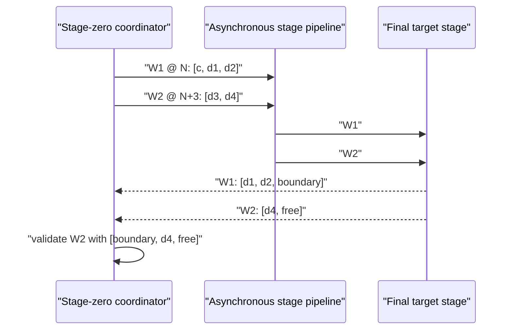

# Pipelined MTP + N-gram Verification

## Purpose

This document describes Skippy's split-decode path that combines native
multi-token prediction (MTP) with a request-local N-gram continuation. There is
no separate model in this path. Native MTP supplies the anchor candidate, the
N-gram cache extends it, and the full staged model remains authoritative for
every emitted token.

The design follows a fixed-depth pipeline:

1. form full multi-token candidate chunks;
2. send them through the stages asynchronously and in FIFO order;
3. return predictions directly from the final stage to the coordinator;
4. keep the configured number of windows in flight while candidates remain;
5. discard later results after the first divergence and refill immediately.

Public mesh gossip and the OpenAI-compatible API are unchanged. The internal
stage protocol is intentionally incompatible with the previous reply shape.

## Terms

| Term | Meaning |
|---|---|
| Target | The full staged model and sole token authority. |
| Native MTP | Model-provided candidate tokens attached to a target reply. |
| N-gram continuation | Exact request-local cache continuation after the MTP prefix. |
| Composite proposal | Native-MTP prefix followed by zero or more N-gram tokens. |
| Verification chunk | A bounded contiguous part of the composite proposal. |
| Epoch | One optimistic candidate branch, possibly containing several chunks. |
| Stale window | In-flight work invalidated by an earlier mismatch or stop. |

## Correctness Invariant

Candidates are never committed directly. For each epoch the coordinator emits
only the longest prefix reproduced by the target. At the first mismatch it
emits the target correction and marks all later windows from that epoch stale.

The request-local N-gram index contains committed target history only.
Optimistic suffixes may be queried to extend the current branch, but they are
never inserted into the index before target acceptance.

## Stage Protocol v10

`STAGE_STATE_VERSION` is `10`, and `VerifyWindow` is message kind `21`.
Every verification request carries:

- a FIFO window ID;
- an authoritative absolute start position;
- a contiguous token input;
- the target sampling configuration.

Every reply carries the same window ID, the target predictions, stage timing,
and an optional typed native-MTP candidate. The removed `accepted_len` and
`correction_token` fields duplicated policy at the final stage and could not
describe continuation chunks correctly. Acceptance now has one owner: the
coordinator, which has both the prior boundary prediction and the current
reply.

The final stage returns verification replies directly to stage zero. Stage zero
first opens a bounded return sink toward the tail; if that handshake is not
available, the tail opens the reverse direct-return connection. A request does
not start pipelined verification without a registered receiver.

## Non-overlapping Verification Chunks

Let `c` be the current unprocessed target token and let the composite candidate
be `[d1, d2, d3, d4]`. With chunk width two, stage zero sends:

| Chunk | Absolute inputs | Target predictions used by coordinator |
|---|---|---|
| 1, epoch start | `[c, d1, d2]` | `[p(d1), p(d2), boundary]` |
| 2, continuation | `[d3, d4]` | `[p(d4), free]` plus chunk 1 `boundary` |

Chunk 1 validates `d1` and `d2`. Its final free prediction is the target's
prediction for `d3`. Chunk 2 begins at the next absolute position, consumes
only `d3` and `d4`, and predicts `d4` plus one new free token. The coordinator
reconstructs chunk 2's target vector as:

```text
[chunk_1_boundary, chunk_2_prediction_0, chunk_2_prediction_1]
```

This validates both candidates and retains a new boundary prediction without
reprocessing the last token of chunk 1.



The end position of one traversal is exactly the start position of the next.
On a fully accepted epoch, target KV and native-MTP state advance monotonically:
there is no accepted-path trim, checkpoint restore, or repair replay.

## Divergence And Refill

Replies retire in FIFO order. When a window diverges:

1. the coordinator commits its matching prefix and target correction;
2. all later windows in the same epoch become stale;
3. completed stale work is drained and measured but never emitted;
4. a new epoch may be queued behind the stale work as soon as capacity exists;
5. its authoritative start position trims only the invalid target suffix.

The removed native-MTP checkpoint ring existed to repair the old accepted-path
one-token rewind between overlapping chunks. It is unnecessary with contiguous
continuations. A real divergence uses the native runtime's conservative local
trim and bounded MTP re-prime; no repair message or replay protocol exists.

## Fixed-depth Scheduling

`verify_window_pipeline_depth` is the per-request FIFO capacity. It is not an
adaptive profitability target and is not divided by generation concurrency.
While an epoch has candidates, the coordinator fills every available slot up
to that depth. When a reply retires, it immediately attempts to refill the
vacated slot from the request-local N-gram continuation.

The remaining bounds are:

- the normal generation admission semaphore and lane pool;
- `verify_window_pipeline_depth` per request;
- `verify_window_max_tokens` per traversal;
- `extension_max_tokens` for each cache continuation lookup;
- `ngram_max_proposal_tokens` for cache output.

Depth one preserves serial verification. A depth greater than one activates
the asynchronous path only when a composite MTP + N-gram candidate is long
enough to create dependent work. Native-MTP-only verification remains the
control path.

## Request-local Candidate Formation

The N-gram cache uses exact matches in committed request history. A match is
eligible immediately; there is no probation, promotion, slow start, cooldown,
global speculative-credit pool, or concurrency-two special case. A rejected
N-gram suffix does not count as rejection of an already accepted native-MTP
prefix.

If the current candidate queue falls below one chunk, the coordinator queries
the cache after the full optimistic suffix. Successful continuation appends new
tokens to the epoch and keeps the configured pipeline depth occupied.

## Configuration

A package may declare native MTP plus a request-local cache proposer:

```json
{
  "generation": {
    "speculative_decoding": {
      "default": "mtp-cache",
      "proposers": {
        "mtp": {
          "type": "native-mtp",
          "prediction_depth": 1,
          "layer_indices": [47]
        },
        "cache": {
          "type": "ngram-cache",
          "ngram_min": 2,
          "ngram_max": 4,
          "max_proposal_tokens": 16,
          "history_scope": "request"
        }
      },
      "strategies": {
        "mtp-cache": {
          "type": "composite",
          "primary": "mtp",
          "extender": "cache",
          "extension_policy": {
            "max_tokens": 16
          }
        }
      }
    }
  }
}
```

Equivalent model configuration is:

```toml
[[models]]
model = "meshllm/GLM-4.7-Flash-MTP-GGUF:Q4_K_M"

[models.speculative]
strategy = "mtp-cache"
ngram_min = 2
ngram_max = 4
ngram_max_proposal_tokens = 16
extension_max_tokens = 16
verify_window_min_tokens = 1
verify_window_max_tokens = 4
verify_window_pipeline_depth = 2
```

For comparisons, use `strategy = "mtp"` as the native-MTP control and
`strategy = "disabled"` as the no-speculation control. The MTP + N-gram path
does not require a standalone model or service.

## Measurement Contract

Throughput alone is insufficient. A pipeline result must report:

| Question | Evidence |
|---|---|
| Did it improve output rate? | wall completion TPS and `predicted_per_second` |
| Did it reduce exposed latency? | TTFT and inter-token latency percentiles |
| Was the queue actually full? | `verify_window_occupancy_ms_by_depth`, average in-flight, parallel/full fractions |
| Were stages busy simultaneously? | per-window `compute_start_unix_nanos` / `compute_end_unix_nanos`, grouped by stage and window ID |
| Was network delay hidden? | stage compute intervals versus forward-write and downstream-wait intervals |
| What was wasted? | stale marked/discarded counts and stale compute/write/wait/elapsed time |
| Did candidates remain useful? | proposed tokens, accepted tokens, full-accept windows, first-reject position |
| Did the horizon remain supplied? | refill attempts, successes, tokens, and misses |
| Was output correct? | token-for-token control comparison and finish reason |

For the GLM-4.7 two-host lab, sweep depths `1, 2, 4, 8, 16` with matched
prompt/output corpora, verification width, topology, lane count, sampling, and
request concurrency. Repeat under injected inter-stage latency. The useful
frontier is the shallowest depth where throughput approaches the bottleneck
stage service rate and added depth mostly increases stale work.

Compare three controls in the same run family:

1. native MTP;
2. the previous PR #1026 implementation;
3. fixed-depth non-overlapping MTP + N-gram.

Report PR #938 and issue #1025 separately when their topology, model, or
measurement method is not directly comparable.

## Telemetry Privacy

Pipeline telemetry contains bounded numeric counts, durations, booleans, and
stage/window identifiers needed to join timing spans. It does not export
prompts, completions, token IDs, speculative suffixes, paths, endpoints, or raw
node identities. Debug OTLP export remains operator-configured. Every worker
applies its own node-local telemetry policy and endpoint when a stage is loaded;
telemetry destinations are not copied from the coordinator or sent over the
stage-control protocol.
